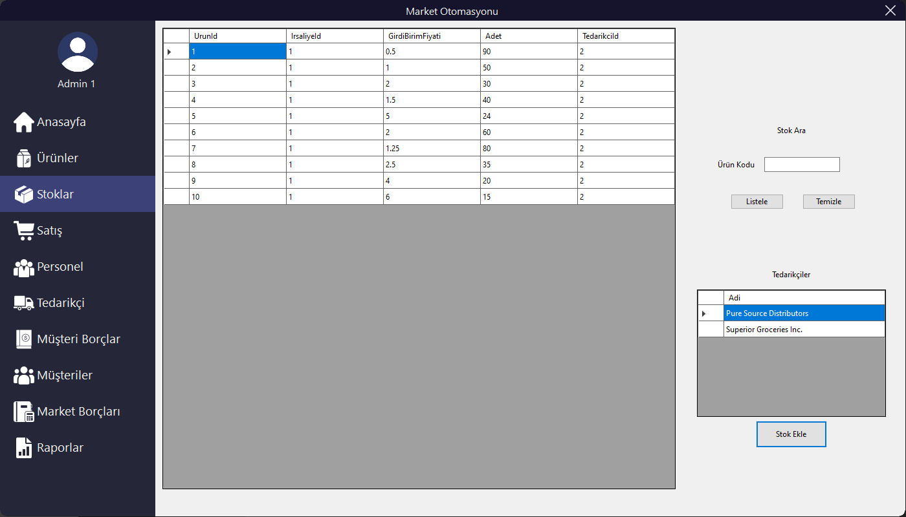

#
<h1 align="center">
  <br>
  
  <br>
  Store Management Application
  <br>
</h1>

<h4 align="center">A comprehensive management application for stores.</h4>

<p align="center">
  <a href="#features">Key Features</a> •
  <a href="#how-to-use">How To Use</a> •
  <a href="#download">Download</a> •
  <a href="#tech-stack">Tech Stack</a>
</p>


## Features
- Adding products and stock with a text file provided by the supplier.
- Ability to sell on credit to registered customers. 
- Advance payment option for anonymous customers.
- Follow-up and payment of debts to suppliers and customer debts.
- Restricted interface for non-administrative staff.
- Plotting the daily sales of the market as a line graph.

### Screenshots

<center>
<table>
<tr>
<td></td>
<td></td>
</tr>
</table>
</center>

## How to Use

```pwsh
# Clone this repository
$ git clone 'https://github.com/mithrilfire/market-otomasyonu.git'

# Go into the repository
$ cd 'market-otomasyonu'

# Install dependencies before build to update database
dotnet restore

# Update database using Entity Framework
dotnet ef database update

# To build project:
dotnet build

# To run project:
dotnet run
```

### Adding New Stock and Products
Products and stocks are added to the system with the delivery note file provided by the supplier.

The format of the delivery note should be like this:
`DeliveryId,ProductId,Barcode,ProductName,InputUnitPrice,UnitPrice,Quantity`

And every stock record should be separated by a new line.

An example delivery note:
```
1,1,1,Fresh Organic Apples,0.50,0.75,100
1,2,2,Whole Wheat Bread,1.00,1.50,50
1,3,3,Free-Range Eggs,2.00,3.00,30
1,4,4,Almond Milk,1.50,2.50,40
1,5,5,Grass-Fed Ground Beef,5.00,7.00,25
1,6,6,Gluten-Free Pasta,2.00,3.00,60
1,7,7,Greek Yogurt,1.25,2.00,80
1,8,8,Quinoa,2.50,4.00,35
1,9,9,Fair Trade Coffee,4.00,6.00,20
1,10,10,Extra Virgin Olive Oil,6.00,9.00,15
```

## Download
*Will be added soon.*

## Tech Stack
- [.Net 7](https://dotnet.microsoft.com/en-us/)
- [EF Core 7](https://learn.microsoft.com/en-us/ef/core/)
- [Live Charts 2](https://livecharts.dev/)
- [Affinity Photo V2](https://affinity.serif.com/en-gb/photo/)
- [RealFaviconGenerator](https://realfavicongenerator.net/)